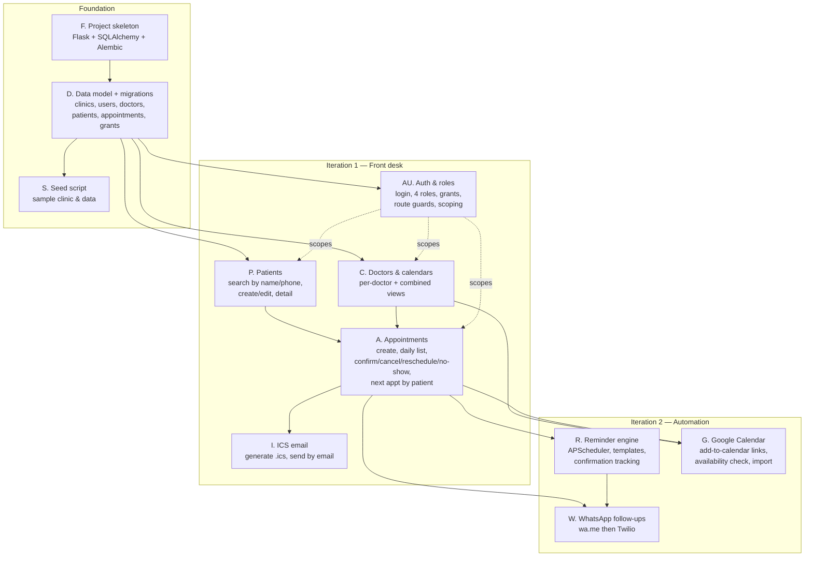

# ClinicRemind — Implementation Plan

## Scope of this plan

This plan is **appointments-first**. The original concept led with automated
WhatsApp reminders; based on how the clinic actually works, we are reordering:
the front-desk scheduling experience comes first, and automation/calendar
integration is deferred to a second iteration.

- **Iteration 1** — run the front desk: multi-doctor calendars, patient lookup,
  scheduling lifecycle (confirm / cancel / reschedule / no-show), and sending an
  appointment as an **ICS file by email**. No WhatsApp, no automated reminders,
  no Google Calendar.
- **Iteration 2** — automation: WhatsApp follow-ups, automated reminders, and
  Google Calendar integration (including availability validation when booking).

---

## Architecture Overview

- **Clinic** is the top-level entity. All data (patients, appointments) belongs
  to a clinic.
- **Postgres is the single source of truth.**
- **Users vs. doctors are distinct.** A *user* is a login (super admin / admin /
  receptionist / doctor). A *doctor* is a calendar owner that may or may not have
  a login. One user can be both an admin and a doctor.
- **Patients are clinic-wide contact records** — name, phone, email, notes. No
  clinical/medical records are stored. A patient can have appointments with any
  doctor; the receptionist books with whichever doctor and sees that doctor's
  next available slot. There is no per-doctor duplication of patients.
- **Frontend** is server-rendered HTML (Jinja2 + HTMX + Alpine.js), served
  directly by Flask. No build step.

### Entity hierarchy

```
Clinic
  ├── Users (logins; roles: super_admin | admin | receptionist | doctor)
  ├── Doctors (calendar owners; optionally linked to a user)
  ├── Patients (clinic-wide contact records — no clinical data)
  ├── Appointments (patient + doctor + time + status)
  └── Doctor→Receptionist grants (who a receptionist is allowed to work for)
```

---

## Roles & Data Visibility

| Role | Visibility |
|---|---|
| **Super Admin** (support / me) | All clinics, all data. Operates above the clinic boundary. |
| **Admin** | All data within their clinic. Can also be a doctor (own calendar). Manages doctors, receptionists, settings, and grants. |
| **Doctor** | Own calendar and own patients only — cannot see other doctors' data. Can grant/revoke receptionist access to their own data. |
| **Receptionist** | Only the data of doctors who currently **grant** them access. No grants = sees nothing. Can do all front-desk actions for granted doctors. |

### Receptionist access grants

A receptionist is **not** automatically clinic-wide. A doctor (for their own
data) **or** an admin (on any doctor's behalf) must grant access first. A
receptionist's effective scope = appointments + patients of the doctors who
currently grant them.

```
doctor_receptionist_grants
  id, clinic_id, doctor_id, receptionist_user_id, granted_at, revoked_at
```

### A doctor's view of patients

A doctor sees only the patients they have appointments with. This is **derived
from appointments**, not from ownership — no `owner_doctor_id` needed.
Receptionists and admins see the relevant clinic-wide patient list.

---

## Stack

| Layer | Choice | Notes |
|---|---|---|
| Language | Python 3.12 | |
| Web framework | Flask | Serves pages + routes |
| ORM | SQLAlchemy | |
| Migrations | Alembic | |
| Database | PostgreSQL | Source of truth |
| Auth | Flask-Login + bcrypt | Session-based |
| Frontend | HTMX + Alpine.js + Jinja2 | Server-rendered, no build step |
| Email / ICS | SMTP or provider (Resend / SES) + `ics` lib | Iteration 1 outbound channel |
| Scheduler | APScheduler | Iteration 2 (reminders) |
| WhatsApp | `wa.me` links → Twilio | Iteration 2 |
| Google Calendar | "Add to Calendar" links + OAuth import | Iteration 2 |
| Hosting | TBD (Railway / Render / Fly.io) | |

---

## Task Tracks & Dependencies

The work is grouped into **tracks**. The diagram below shows sequence and what
can run in parallel — it is a dependency map, not a timeline.



### How to read it

- **Foundation must finish first** (F → D → S). Everything depends on the data
  model.
- Once the model exists, **Patients (P)** and **Doctors/calendars (C)** can be
  built **in parallel** — they don't depend on each other.
- **Appointments (A)** needs both P and C (you book a patient with a doctor).
- **ICS email (I)** depends only on appointments existing.
- **Auth (AU)** can be developed **in parallel** with P/C/A right after the data
  model, then *wraps around* the front-desk routes to enforce role scoping
  (dashed lines). Practical approach: build features against a hardcoded clinic
  context, then layer auth + scoping on top.
- **Iteration 2** all hangs off a working appointments core. Reminders (R) and
  WhatsApp (W) build on appointments; Google Calendar (G) builds on appointments
  + calendars. R and G can proceed in parallel; W's automatic-send mode builds on
  R.

### Suggested order of attack

1. **F → D → S** (foundation) — sequential, do first.
2. **P and C in parallel**, with **AU** started alongside.
3. **A** once P and C land.
4. **I** and finishing **AU scoping** — can overlap.
5. Iteration 2: **R** and **G** in parallel, then **W**.

---

## Build Order (task checklist)

### Foundation
- [ ] Flask project structure, SQLAlchemy, Alembic
- [ ] Define and migrate all tables (see schema below)
- [ ] Seed script: sample clinic, doctors, patients, appointments
- [ ] Hardcoded single-clinic context for early development (auth added later)

### P — Patients
- [ ] Patient model: name, phone(s), email, notes (clinic-wide, no clinical data)
- [ ] Search by name or phone (partial match, normalized phone digits)
- [ ] Create / edit patient
- [ ] Patient detail page with appointment history
- [ ] **Find next appointment(s) by patient — independent of doctor**

### C — Doctors & calendars
- [ ] Doctor entity (optionally linked to a user login)
- [ ] Per-doctor day / week calendar view
- [ ] Combined "all doctors" view
- [ ] Filter appointment views by doctor

### A — Appointments (core)
- [ ] Create appointment: pick patient (inline "new patient"), doctor, date/time,
      duration, notes
- [ ] Daily appointment list (next days, filterable by date + doctor)
- [ ] Status lifecycle: `pending | confirmed | cancelled | no_show`
- [ ] Actions: confirm / cancel / reschedule / mark no-show
- [ ] Reschedule keeps a record of the change

### I — ICS email
- [ ] Generate a valid `.ics` VEVENT from an appointment
- [ ] Send email with the ICS attached (SMTP or provider)
- [ ] Manual "email this appointment" action; optional auto-send on create/reschedule
- [ ] Email template (clinic, doctor, date/time, location, notes)

### AU — Auth & roles
- [ ] Login (Flask-Login + bcrypt), session management
- [ ] Roles: `super_admin | admin | receptionist | doctor`; a user may hold more
      than one role and may also be linked to a doctor entity
- [ ] Route guards: doctor-management + settings restricted to admin/super admin
- [ ] Data scoping per role (doctor = own data; receptionist = granted doctors;
      admin = clinic; super admin = all clinics)
- [ ] Doctor→Receptionist grant management (grantable by the doctor or an admin)
- [ ] Seed an initial admin; admin creates other accounts (email-invite flow
      deferred to iteration 2)
- [ ] Super Admin clinic-switching / impersonation context

### Iteration 2
- [ ] **R — Reminder engine**: APScheduler daily job, per-clinic send time +
      template, per-appointment reminder/confirmation state
- [ ] **W — WhatsApp**: `wa.me` manual links first, then Twilio automatic sends
- [ ] **G — Google Calendar**: "Add to Google Calendar" links; availability /
      free-busy check when booking; one-time onboarding import (OAuth read-only,
      tokens discarded after import)
- [ ] Dashboard: tomorrow's appointments + confirmation status
- [ ] Follow-up view: cancellations + non-responders

---

## Database Schema

```
clinics
  id, name, phone, timezone, created_at

users
  id, email, password_hash, name, is_super_admin, created_at

clinic_members
  id, clinic_id, user_id, role (admin | receptionist | doctor)
  -- a user may have more than one membership row per clinic

doctors
  id, clinic_id, user_id (nullable), name, created_at
  -- calendar owner; user_id links to a login when the doctor has one

doctor_receptionist_grants
  id, clinic_id, doctor_id, receptionist_user_id, granted_at, revoked_at

patients
  id, clinic_id, name, phone, email, notes, created_at, updated_at
  -- clinic-wide contact record; no clinical data

appointments
  id, clinic_id, patient_id, doctor_id,
  start_at, end_at,
  status (pending | confirmed | cancelled | no_show),
  notes, created_at, updated_at

-- Iteration 2
reminders
  id, appointment_id, sent_at, status, method (wa_link | twilio), message_body
```

---

## Resolved Decisions

- **Scope reorder** — front-desk scheduling first; WhatsApp / reminders / Google
  Calendar deferred to iteration 2.
- **No clinical records** — patients are contact records only.
- **Patients are clinic-wide** — no per-doctor duplication; a doctor's view is
  derived from their appointments.
- **Four roles** — super admin, admin, receptionist, doctor; users can hold
  multiple roles and an admin can also be a doctor.
- **Receptionist access is grant-based** — granted by the doctor or an admin.
- **ICS by email** is the iteration-1 outbound channel.

## Open Questions

1. Phone storage — normalize to E.164 for reliable search across formats?
2. Double-booking — should v1 prevent booking a doctor into an occupied slot, or
   just warn?
3. Reschedule history — full audit trail of moves, or just keep the latest time +
   an `updated_at`?
4. Should a doctor be able to belong to more than one clinic (works at two
   locations)?
